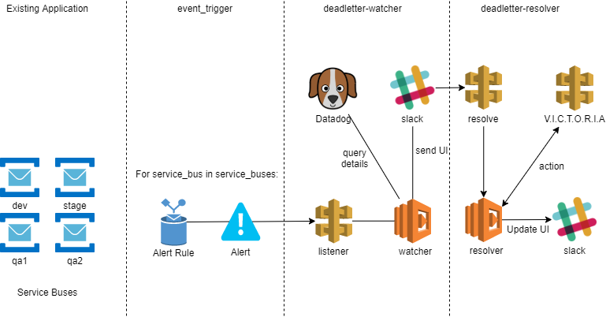

# dead-letter-watcher
A series of Azure Functions that wait for events to handle dead-letters


## Architecture
The archictecture comprises of 3 services:
- [event_trigger](#event-trigger-service)
- deadletter_watcher
- deadletter_resolver



### Event Trigger Service
This service deploys the nessassary components in order to:
- create the alerts for when the deadlettered messages threshold surpases 0
- contact the webook for deadletter-watcher service

### Deadletter Watcher Service

# Secrets
```
{
    "PULUMI": {
        "SERVICE_BUS_RESOURCE_GROUP": str,
        "SERVICE_BUS_NAMESPACE": str,
        "DEADLETTER_WATCHER_ENDPOINT": str,
        "SERVICE_BUS_QUEUES":[ str ]
    },
    "DL-WATCHER": {
        "SLACK_CHANNEL": str,
        "BOT_TOKEN": str
    },
    "SERVICE_BUS_CONNECTION_STRINGS": {
        { 'str': 'str' }
    }
}
```
